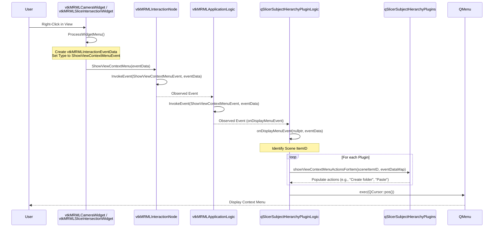
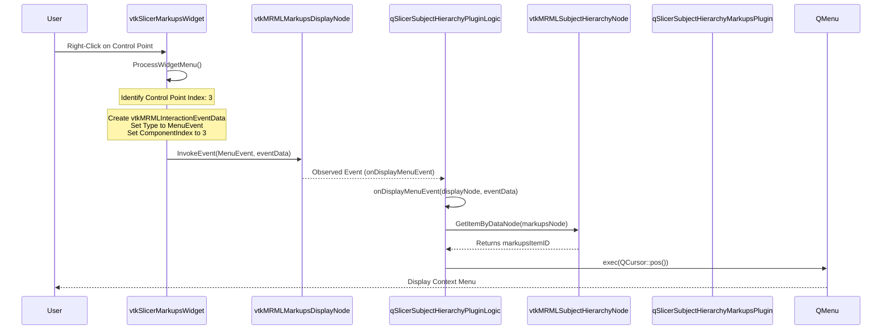

```mermaid
sequenceDiagram
    participant User
    participant Widget as vtkMRMLCameraWidget /<br/>vtkMRMLSliceIntersectionWidget
    participant IntNode as vtkMRMLInteractionNode
    participant AppLogic as vtkMRMLApplicationLogic
    participant SHLogic as qSlicerSubjectHierarchyPluginLogic
    participant SHPlugins as qSlicerSubjectHierarchyPlugins
    participant Menu as QMenu
    User ->> Widget: Right-Click in View
    Widget ->> Widget: ProcessWidgetMenu()
    Note over Widget: Create vtkMRMLInteractionEventData<br/>Set Type to ShowViewContextMenuEvent
    Widget ->> IntNode: ShowViewContextMenu(eventData)
    IntNode ->> IntNode: InvokeEvent(ShowViewContextMenuEvent, eventData)
    IntNode -->> AppLogic: Observed Event
    AppLogic ->> AppLogic: InvokeEvent(ShowViewContextMenuEvent, eventData)
    AppLogic -->> SHLogic: Observed Event (onDisplayMenuEvent)
    SHLogic ->> SHLogic: onDisplayMenuEvent(nullptr, eventData)
    Note over SHLogic: Identify Scene ItemID

    loop For each Plugin
        SHLogic ->> SHPlugins: showViewContextMenuActionsForItem(sceneItemID, eventDataMap)
        SHPlugins -->> SHLogic: Populate actions (e.g., "Create folder", "Paste")
    end

    SHLogic ->> Menu: exec(QCursor::pos())
    Menu -->> User: Display Context Menu
```

```mermaid
sequenceDiagram
    participant User
    participant MWidget as vtkSlicerMarkupsWidget
    participant MDisplay as vtkMRMLMarkupsDisplayNode
    participant SHLogic as qSlicerSubjectHierarchyPluginLogic
    participant SHNode as vtkMRMLSubjectHierarchyNode
    participant MPlugin as qSlicerSubjectHierarchyMarkupsPlugin
    participant Menu as QMenu
    User ->> MWidget: Right-Click on Control Point#3
    MWidget ->> MWidget: ProcessWidgetMenu()
    Note over MWidget: Identify Control Point Index: 3
    Note over MWidget: Create vtkMRMLInteractionEventData<br/>Set Type to MenuEvent<br/>Set ComponentIndex to 3
    MWidget ->> MDisplay: InvokeEvent(MenuEvent, eventData)
    MDisplay -->> SHLogic: Observed Event (onDisplayMenuEvent)
    SHLogic ->> SHLogic: onDisplayMenuEvent(displayNode, eventData)
    SHLogic ->> SHNode: GetItemByDataNode(markupsNode)
    SHNode -->> SHLogic: Returns markupsItemID
    SHLogic ->> Menu: exec(QCursor::pos())
    Menu -->> User: Display Context Menu
```